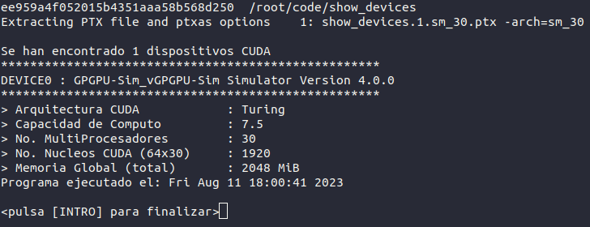

# Parallel Computing in CUDA

Terminal programs applying the parallel programming model with the CUDA arquitecture

## List of terminal programs

| Program file | Description |
| --- | --- |
|**show_devices**| show list of available cuda devices in the system.
|**sum_vectors**| add two vectors.
||*cuda target*: launch a kernel with multiple threads grouped into fix blocks.
|**matrix2dim**| generate a matrix using a existing matrix.
||*cuda target*: using threads of one kernel lauching two dimensions.
|**pi**| roughly calculate the value of pi.
||*cuda target*: making kernel threads work cooperatively using PR algorithm.
|**displacer_matrix**| displacer a matrix 
||*cuda target*: measure the execution time of a kernel.
|**rank_sort_algorithm**| sort a vector using the rank sort algorithm.
||*cuda target*: take advantage of parallelism of the GPU to optimize algorithms.
|**performance**| sort a vector in gpu/cpu to compare the performance.
||*cuda target*: calculate the performance of the gain of GPU relative to CPU.

``` source path:  /root/code ```

# Pre-requisites

1. **docker**
2. **docker-compose**
3. **make**  (optional)
4. **gpu** with **cuda** support (optional)

## NOTE
GPU with CUDA support is optional, if you don't have a gpu with cuda support, you can use the docker image of cuda to run the programs.

The docker image use an emulator (GPGPU-Sim) to emulate NVIDIA GPUs running CUDA and/or OpenCL workloads. to more informatcion, go here: https://github.com/gpgpu-sim/gpgpu-sim_distribution/


## Support for CUDA Deep Neural Network (cuDNN) or Basic Linear Algebra Subprograms (cuBLAS) libraries. (OPTIONAL)

Modify the docker image and add the following steps to execute programs that use these libraries

1. Download cuDNN and cuBLAS libraries from NVIDIA website: https://developer.nvidia.com

2. export the following environment variables
```
$ export CUDNN_PATH=/path/to/cuddn
$ export LD_LIBRARY_PATH=$CUDA_INSTALL_PATH/lib64:$CUDA_INSTALL_PATH/lib:$CUDNN_PATH/lib64
```


# INSTALLING, BUILDING AND RUNNING archcomputing/cuda:0.3 (Docker Image) and cuda (Docker Container)

1. Build/Rebuild image
    ```
    docker-compose build 
    ```

2. Create and start container
    ```
    docker-compose up -d
    ```

3. Enter to the container
    ```
    docker exec -it cuda /bin/bash
    ```

4. Now you can compile and run the programs in the container, either manually or using the Makefile


# Compiling in NVIDIA CUDA COMPILER (nvcc)

## Manual

```
nvcc --cudart shared -o out program.cu
```

Other commands need to be executed to clean  up compiler-generated files and extent file compilation if the program has more than one file

## Makefile

There is a Makefile, its execution is optional. Automates the build/compilation, execution, indentation and cleanup process

### Building

```
make target=program_filename_without_extension
```

or

```
make all target=program_filename_without_extension
```

### Clean

```
make clean target=program_filename_without_extension
```

### Running

```
make run target=program_filename_without_extension
```

### Indent

```
make indent target=program_filename_without_extension
```

### Example

when a cuda device is available




### License

MIT